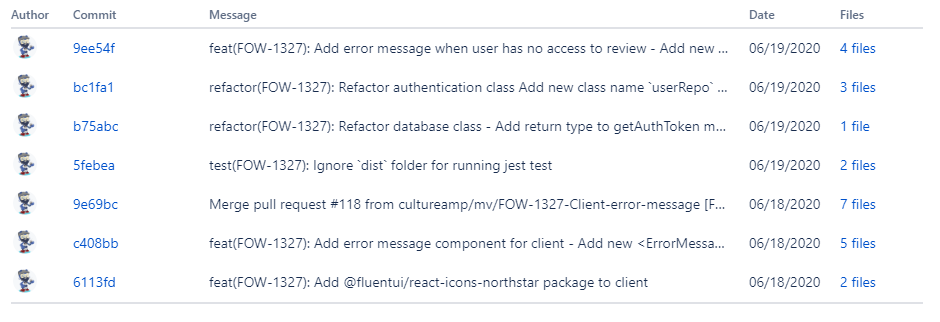

## Git основы

### Оглавление

[Создание](#создание)  
[Коммиты](#none)  
[Обновление коммита](#none)  
[Удалить последний коммит](#none)  
[Редактировать комментарий коммита](#none)  
[Обнулить историю коммитов](#none)  
[Ветки](#none)  
[Слежение](#none)  
[Установка Git](#none)  
[Генерируем SSH-ключи](#none)

[Простой коммит](#простой-коммит)  
[Семантический коммит](#семантический-коммит)  
[Версионирование](#версионирование)  
[Changelog](#ведение-changelog)

https://ru.stackoverflow.com/questions/229431/Как-обнулить-историю-git  
https://ru.stackoverflow.com/questions/431520/Как-вернуться-откатиться-к-более-раннему-коммиту

#### Создание

`git clone git@github.com:user/repo.git test-ssh`  
-- проверка ssh ключа  
`cat > README.md`  
`cat > .gitigonore` (вписать .idea и тд)  
`git init`

#### Подключение

`git add -A` (или `git add .`)  
`git commit -m "Initial commit"` (без ключа -m: многострочный)  
--`git branch -v` (посмотреть ветку и коммит)  
`git remote add origin git@github.com:grand-web/name.git` (указываем ярлык)  
-- (изменить адрес) `git remote set-url origin git@github.com:user/repo_name.git`  
--`git remote` (просмотр "origin")  
--`git remote -v` (просмотр ярлыка)  
`git push -u origin master`

#### Коммиты

`git commit -am "message"` (автоиндексация+коммит)  
`git push `

`git status` (просмотр изменений)  
`git log --oneline` (просмотр коммитов, `q`-выход)

#### Обновление коммита

`git add -A`  
`git commit --amend -m "message"` (изменить комментарий последнего коммита) **ИЛИ**  
`git commit --amend --no-edit` (сделать коммит без редактирования коммита)  
`git push -f (forced)` при проблемах загрузки

#### Удалить последний коммит

`git reset HEAD~` (или sha1)  
`git reset --soft HEAD~1` (не меняет индекс, оставляет файлы)
`git reset --hard HEAD~1` (полное удаление С ФАЙЛАМИ)

#### Редактировать комментарий # коммита

`rebase -i HEAD~n` (дописать `r` вместо `pick`)

#### Обнулить историю коммитов

`git checkout master -перейти на ветку master`  
`git reset --soft <first-commit-sha1>`  
`git commit -m "Reset history"`  
`git remote add origin <url>`  
`git push -u origin --all (или -f)`

#### Синхронизация(обновить из удал.репозитория)

`cd %path%`  
`git pull`  
или `git pull --rebase origin`

### Ветки

`git branch` - показать текущую ветку  
`git checkout -b <имя-новой-ветки>` -создать новую и переключиться  
`git branch <имя>`- новая ветка  
`git checkout <имя>`- переключение  
`git branch -m <новое-имя-ветки> `-переименование текущей ветки

#### Удаление локальной ветки

(вместо mybranch необходимо поставить название ветки, которую вы хотите удалить):  
`git branch -d mybranch` - удаление ветки  
`git branch -D mybranch` (принудительное)

#### Удаление внешней ветки

(вместо origin и mybranch необходимо поставить свои данные):  
`git push origin --delete branch_name`  
`git push origin -d mybranch`

### Слежение

`git add :/` -из корневой дириктории  
`git add .` -из текущей дириктории

#### Убрать файлы из индексации

`git reset` -отменить выполнение команды `git add `  
`git reset myfile.cpp` -удалить из индекса только один файл

[⬆ вернуться к началу](#оглавление)

---

### Установка Git

`sudo apt-get install git `  
`git --version`

#### Настройка Git

`git config --global user.name "ваше имя"`  
`git config --global user.email email@example.com`  
`git config --global init.defaultBranch master` (имя ветки по умолчанию)  
`git config --list` (просмотр всего)

#### Генерируем SSH-ключи

-- _Проверка_  
`ls -al ~/.ssh`  
-- _Создание_ (ed25519 и rsa - алгоритмы генерации)  
`ssh-keygen -t ed25519 -C "your_email@example.com"`  
или `ssh-keygen -t rsa -b 4096 -C "your_email@example.com"`  
-->(предложит новое имя файла, или нажать Enter)

---- _Добавляем SSH-ключ в ssh-agent_  
(программа для хранения и управления SSH-ключами)  
-- запуск агента  
`eval "$(ssh-agent -s)" `  
-- добавление ключа  
`ssh-add ~/.ssh/id_ed25519` (или др.имя)

--- _Добавить ключ на Github_  
`cat ~/.ssh/id_ed25519.pub`  
или вручную скопировать все из этого файла, и добавить ssh ключ на сайте github

---

## Простой коммит:

- Отделяйте заголовок от тела пустой строкой
- Ограничивайте заголовок 50 символами
- Пишите заголовок с заглавной буквы
- Не ставьте точку в конце заголовка
- Используйте повелительное наклонение в заголовке (или средний род)
- Переходите на следующую строку в теле на 72 символах
- В теле отвечайте на вопросы **что и почему**, а не как

Варианты простых (несемантичных) коммитов:  
`Add:`  
`Del:`  
`Fix:`  
`Edit:`  
`Rework:`  
`Update:`  
`Change:`

`[WIP] Интеграция полосы` (Work in Progress)

**ЕЩЕ ПРИМЕР (тело):**

```
[+] Подсветка синтаксиса в редакторе (some_edit_form.php)
[-] Устаревший код и неактуальные комментарии в mycode.php
[*] В форме «some_edit_form.php» поменял «Обновить» на «Сохранить»
```

## Семантический коммит

**`<тип>(необязательный контекст): <описание>`**  
`<пустая строка>`  
[необязательное тело]  
`<пустая строка>`  
[необязательная сноска(и)]

**где `<тип>` может быть одним из следующих:**

`fix:` — **исправляет** баг в вашем коде (соответствует [PATCH](https://semver.org/lang/ru/) в Cемантическом Версионировании).  
`feat:` — **обновляет** новую функцию в ваш код (соответствует [MINOR](https://semver.org/lang/ru/) в Cемантическом Версионировании.

---_разрешенные типы коммитов_---  
`build:` — ??  
`chore:` — обновление рутинных задач\_ и т. д.; без изменения производственного кода.  
`ci` — ?? Непрерывная интеграция  
`docs:` — изменения в документации.  
`style:` — форматирование, отсутствующие точки с запятой и т. д .; без изменения производственного кода.  
`refactor:` — рефакторинг производственного кода, например, переименование переменной.  
`perf:` — производительность.  
`test:` — добавление недостающих тестов, рефакторинг тестов; без изменения производственного кода.  
`improvement:` — (рекоменд.) улучшение. Для коммитов, которые улучшают текущую реализацию без добавления новой функциональности или исправления ошибок.

коммит, который имеет сноску `BREAKING CHANGE`(Важное изменение) или коммит, заканчивающийся восклицательным знаком (!) после типа или контекста, вводящий **изменение(я), нарушающие обратную совместимость** (соответствует [MAJOR](https://semver.org/lang/ru/) в Cемантическом Версионировании). BREAKING CHANGE может быть частью коммита любого типа.

`(необязательный контекст)` — (scope, область) может быть определен для любого типа коммита, чтоб описать область коммита. Она содержится в круглых скобках, например, `feat(parser): add ability to parse arrays`.

**ПРИМЕРЫ:**

_Коммит, добавляющий новую функциональность и содержащий описание нарушения обратной совместимости в теле:_

```git
feat: allow provided config object to extend other configs

BREAKING CHANGE: `extends` key in config file is now used for extending other config files
```

_Сообщение коммита с (`!`) для привлечения внимания к `BREAKING CHANGE`_:

```git
feat!: send an email to the customer when a product is shipped

BREAKING CHANGE: `extends` key in config file is now used for extending other config files
```

_Коммит без тела:_

```git
docs: correct spelling of CHANGELOG
```

_Коммит с указанной областью (scope):_

```git
feat(lang): added polish language
```

_Сообщение коммита с телом из нескольких абзацев и несколькими сносками:_

```git
fix: prevent racing of requests

Introduce a request id and a reference to latest request. Dismiss
incoming responses other than from latest request.

Remove timeouts which were used to mitigate the racing issue but are
obsolete now.

Reviewed-by: Z
Refs: #123
```

_Коммит, исправляющий баги и содержащий (необязательный) номер в баг-трекере (issue) в подвале:_

```git
fix: minor typos in code

see the issue for details on the typos fixed

fixes issue #12
```

### Спецификация

Слова «MUST», «MUST NOT», «REQUIRED», «SHALL», «MAY» и «OPTIONAL» в данном
документе должны интерпретироваться как в [RFC 2119](https://www.ietf.org/rfc/rfc2119.txt).

1. Коммиты должны (MUST) начинается с _типа_, который является существительным:
   `feat`, `fix` и т.д. За ним следует необязательный (OPTIONAL) _контекст_,
   необязательный (OPTIONAL) восклицательный знак (`!`) и обязательные
   (REQUIRED) двоеточие (`:`) и пробел (` `).
1. _Тип_ `feat` должен (MUST) использоваться, когда коммит добавляет новый
   функционал в ваше приложение или вашу библиотеку.
1. _Тип_ `fix` должен (MUST) использоваться, когда коммит исправляет баг в
   вашем приложении или вашей библиотеке.
1. _Контекст_ может (MAY) следовать после _типа_. _Контекст_ должен (MUST)
   быть существительным, заключённым в круглые скобки, описывающий часть
   кодовой базы, которую затронул коммит. Например, `fix(parser)`.
1. _Описание_ должно (MUST) следовать сразу за двоеточием (`:`) и пробелом
   (` `) после _типа_ или _контекста_. _Описание_ представляет собой краткое
   изложение изменений кода. Например, `fix: array parsing issue when multiple
spaces were contained in string`.
1. _Тело_ коммита может (MAY) следовать после короткого _описания_, добавляя
   дополнительную контекстную информацию об изменениях в коде. _Тело_ должно
   (MUST) отделяться от _описания_ одной пустой строкой.
1. _Тело_ коммита имеет произвольную форму и может (MAY) состоять из любого
   количества абзацев, разделённых новой строкой.
1. В одной или нескольких _сносках_ может (MAY) быть одна пустая строка после
   _тела_. Каждая _сноска_ должна (MUST) состоять из токена слова, за которым
   следует разделитель `:<пробел>` или `<пробел>#`, за которым следует
   строковое значение (основано на [git trailer format](https://git-scm.com/docs/git-interpret-trailers)).
1. Токен _сноски_ должен (MUST) использовать `-` вместо пробельных символов.
   Например, `Acked-by` (это помогает отличить раздел _сноски_ от его _тела_,
   состоящего из нескольких абзацев). Исключение составляет `BREAKING CHANGE`,
   которое может (MAY) также использоваться как токен.
1. _Сноска_ может (MAY) содержать пробелы и символы новой строки, а считывание
   должно (MUST) завершаться при обнаружении следующей допустимой пары
   токен-разделитель _сноски_.
1. Критические изменения должны (MUST) быть указаны в _типе_, _контексте_ или
   _сноске_ коммита.
1. Если `BREAKING CHANGE` включено в _сноску_, то оно должно (MUST) состоять из
   прописного текста `BREAKING CHANGE`, за которым следует двоеточие (`:`),
   пробел (` `) и _описание_. Например, `BREAKING CHANGE: environment
variables now take precedence over config files`.
1. Если критические изменения находятся в _типе_ или _контексте_, то они должны
   (MUST) быть обозначены восклицательным знаком (`!`), непосредственно перед
   двоеточием (`:`). Если используется восклицательный знак (`!`), то
   `BREAKING CHANGE` может (MAY) быть опущен в _сноске_, а _описание_ коммита
   должно (SHALL) использоваться для описания критического изменения.
1. В ваших сообщениях коммитов могут (MAY) использоваться _типы_, отличные от
   `feat` и `fix`. Например, `docs: updated ref docs`.
1. Единицы информации, которые составляют «Соглашение о коммитах», не должны
   (MUST NOT) обрабатываться разработчиками как чувствительные к регистру, за
   исключением `BREAKING CHANGE`, которое должно (MUST) быть прописными.
1. `BREAKING-CHANGE` должен (MUST) быть синонимом `BREAKING CHANGE` при
   использовании в качестве токена в _сноске_.

#### Зачем использовать «Соглашение о коммитах»

- Автоматическое создание списков изменения (changelog).
- Автоматическое определение семантического повышения версии (на основе типов совершённых коммитов).
- Информирование товарищей по команде, общественности и других заинтересованных сторон о характере изменений.
- Запуск процессов сборки и публикации.
- Упрощать людям участие в ваших проектах, позволив им изучить более структурированную историю коммитов.

#### Как мне поступать с сообщениями коммитов на начальном этапе разработки?

Мы рекомендуем действовать так, как если бы вы уже выпустили продукт. Обычно кто-то, даже если это ваши коллеги-разработчики программного обеспечения, использует ваше программное обеспечение. Они захотят знать, что исправлено, что ломается и т. д.

#### Типы в заголовке коммита должны быть прописными или строчными?

Выберите тот, который больше всего вам нравится, и строго ему следуйте. (В любом регистре)

#### Что мне делать, если коммит соответствует более чем одному типу?

По возможности вернитесь назад и сделайте несколько коммитов. Часть преимущества «Соглашения о коммитах» - его способность побуждать нас делать более организованные коммиты и PRs (pull requests, или запросы на вытягивание).

#### Разве это не препятствует интенсивной разработке и быстрой итерации?

Это препятствует быстрому неорганизованному движению. Это поможет вам быстро продвигаться в долгосрочной перспективе в нескольких проектах с разными участниками.

#### Как «Соглашение о коммитах» обрабатывает отмену коммитов?

Мы оставляем авторам использование гибкости типов и сносок для разработки своей логики для обработки отмены изменений.
Одна из рекомендаций — использовать тип revert и сноску, которая ссылается на отменяемые хэш-суммы коммитов. Например:

```git
revert: let us never again speak of the noodle incident

Refs: 676104e, a215868
```

### Интеграция с Jira

```
`<type>`(`<номер тикета jira>`): `Название коммита`
```

пример:

```git
refactor(FOW-1327): рефакторинг класса аутентификации
добавить новое имя класса `userRepo` и извлечь вызов api в `/api/v1/users/me` из аутентификации в отдельный класс и использовать новый класс для хранения всех внешних вызовов api, связанных с данными пользователя
```



[Подробнее о Соглашении Коммитов](https://www.conventionalcommits.org/ru/v1.0.0/)

[⬆ вернуться к началу](#оглавление)

---

### Версионирование

**Семантическое Версионирование** (англ. Semantic Versioning), также известный как **semver** (семвер) — спецификация о том, как присваивать версии релизам программного обеспечения.

Основная идея в том, что версия должна состоять из трёх обязательных номерных версий: `{major}.{minor}.{patch}.`

- Мажорная версия — та версия, в которой можно полностью менять поведение, API, удалять старый код и т.д. Изменение данной версии, как правило, требует очень тщательного изучения различий между той, что используется на данный момент проектом. Они могут быть совершенно несовместимы. То, насколько мягким будет переход, зависит только от разработчиков.
- Минорная версия — предназначена для добавления нового функционала или внесения больших изменений, которые соблюдают обратную совместимость (BC).
- Патч версия — используется для внесения мелких изменений, в основном, исправлений ошибок или легкий рефакторинг кода.

Семантическое версионирование также поддерживает и дополнительные части, идущие после патч версии. Например, там могут быть метки о том что это предварительный релиз или какой-то конкретный билд. Например: `1.2.3-beta.1, 1.2.3+abc123` или `1.2.3-beta.1+abc123` — обратите внимание что билд отделяется `+` (плюс), а наименование предварительного релиза `-` (дефис). Данные дополнительные указатели говорят о том, что релиз не стабильный, и в нём могут как всё поменять, так и вовсе удалить, либо добавить совершенной новый функционал в будущем.

Зная как устроено данное именование, можно легко управлять зависимостями, например в _Composer_, который также использует семантическое версионирование. Это позволяет делать более точные ограничения, например, разрешить обновлять пакет только в пределах патч релиза, и вы будете уверены, что никакой новый API не попадёт на проект, а будут поступать только исправления ошибок.

https://semver.org/lang/ru/  
https://habr.com/ru/company/beelinekz/blog/664190/
https://git-scm.com/book/ru/v2/Основы-Git-Работа-с-тегами  
https://habr.com/ru/company/Voximplant/blog/281593/  
https://wiki.merionet.ru/servernye-resheniya/113/chto-takoe-semanticheskoe-versionirovanie/
https://wiki.merionet.ru/servernye-resheniya/113/chto-takoe-semanticheskoe-versionirovanie/

остальное

<!-- FIXME ДОБАВИТЬ merge,  rebase, pull request
git tags!
 -->

---

## Ведение CHANGELOG

https://keepachangelog.com/ru/0.3.0/
https://keepachangelog.com/ru/1.1.0/
