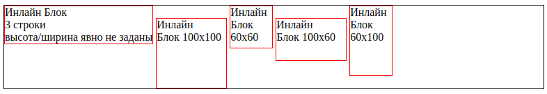
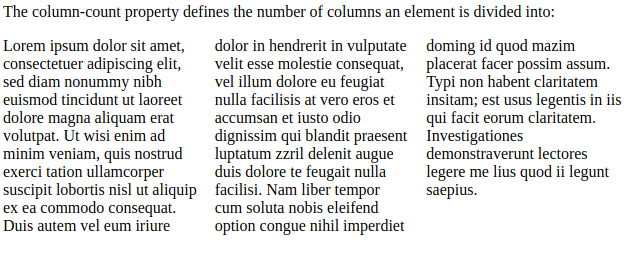
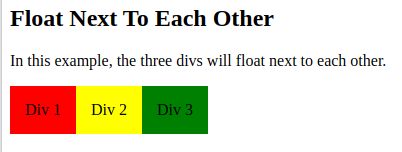
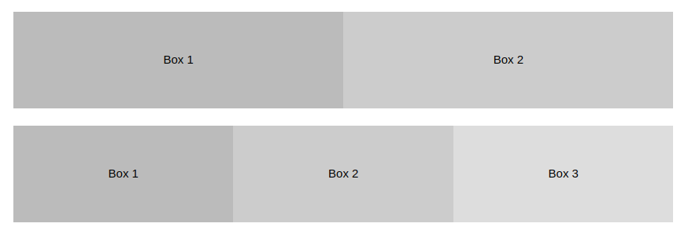
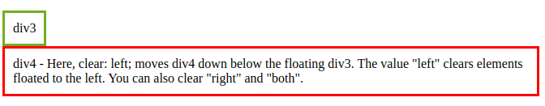
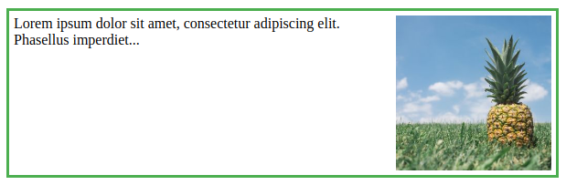
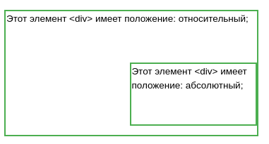
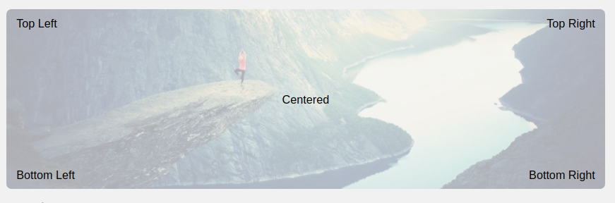

## HTML. Потоковые контейнеры

<!-- FIXME ВСЕ прочитать -->

### Оглавление

[Свойства display](#список-свойств-display)  
[Колонки](#колонки-column)  
[Значение Float](#float)  
[Clear](#clear)  
[Box-sizing (точный размер по пикселям)](#box-sizing-border-box)  
[Выравнивание `inline`](#выравнивание)  
[Свойство position (relative/absolute)](#свойство-position)  
[Размещение-в-изображении](#размещение-текста-в-изображении)  
[Выравнивание (top/left/right/bottom)](#выравнивание-2)

### Свойство `display`


#### Значение `block`

```html
<div style="border:1px solid black">
  <div style="display:block; border:1px solid blue; width: 50%">Первый</div>
  <div style="display:block; border:1px solid red">Второй</div>
  <div style="display:none">Я - скрыт!</div>
  <div style="visibility:hidden">Я - невидим!</div>
</div>
```

<div style="border:1px solid black">
  <div  style="display:block; border:1px solid blue; width: 50%">Первый</div>
  <div style="display:block; border:1px solid red">Второй</div>
  <div style="display:none">Я - скрыт!</div>
  <div style="visibility:hidden">Я - невидим!</div>
</div>

Блоки прилегают друг к другу вплотную, если у них нет `margin`.

#### Значение `inline`

> ❗Ширина и высота элемента определяются по содержимому. Поменять их нельзя.

```html
<span style="border:1px solid black">
  <span style="border:1px solid blue; width:50%">Ширина</span>
  <a style="border:1px solid red">Игнорируется</a>
</span>
```

<span style="border:1px solid black">
  <span style="border:1px solid blue; width:50%">Ширина</span>
  <a style="border:1px solid red">Игнорируется</a>
</span>

Если вы присмотритесь внимательно к примеру выше, то увидите, что между внутренними `<span>` и `<a>` есть пробел. Это потому, что он есть в HTML. Если расположить элементы вплотную – его не будет.

Содержимое инлайн-элемента может переноситься на другую строку.
При этом каждая строка в смысле отображения является отдельным прямоугольником («line box»). Так что инлайн-элемент состоит из объединения прямоугольников.

```html
<div style="width:200px">
  ...<span style="background: lightgreen">
    Ля Ля Ля Ля Ля Ля Ля Ля Ля Ля Ля Ля Ля Ля Ля Ля Ля Ля Ля Ля Ля Ля Ля Ля Ля
    Ля Ля Ля Ля Ля Ля Ля Ля Ля Ля Ля Ля Ля Ля Ля </span
  >...
</div>
```

<div style="width:200px">
...<span style="background: lightgreen">
  Ля Ля Ля Ля Ля Ля Ля Ля Ля Ля Ля Ля Ля Ля Ля Ля Ля Ля Ля Ля
  Ля Ля Ля Ля Ля Ля Ля Ля Ля Ля Ля Ля Ля Ля Ля Ля Ля Ля Ля Ля
</span>...
</div>

#### Значение `inline-block`

Это значение – означает элемент, который продолжает находиться в строке (`inline`), но при этом может иметь важные свойства блока.

Как и `инлайн`-элемент:  
Располагается в строке.  
Размер устанавливается по содержимому.

Во всём остальном – это `блок`:  
Элемент всегда прямоугольный.  
Работают свойства `width`/`height`.

Это значение `display` используют, чтобы отобразить в одну строку блочные элементы, в том числе разных размеров.

```html
<style>
  li {
    display: inline-block;
    list-style: none;
    border: 1px solid red;
  }
</style>

<ul style="border:1px solid black; padding:0">
  <li>Инлайн Блок<br />3 строки<br />высота/ширина явно не заданы</li>
  <li style="width:100px;height:100px">Инлайн<br />Блок 100x100</li>
  <li style="width:60px;height:60px">Инлайн<br />Блок 60x60</li>
  <li style="width:100px;height:60px">Инлайн<br />Блок 100x60</li>
  <li style="width:60px;height:100px">Инлайн<br />Блок 60x100</li>
</ul>
```



Свойство `vertical-align` позволяет выровнять такие элементы внутри внешнего блока (добавили в style декларацию `vertical-align: middle;`):


#### Значения `table`

Современные браузеры позволяют описывать таблицу любыми элементами, если поставить им соответствующие значения `display`.

Для таблицы целиком `table`, для строки – `table-row`, для ячейки – `table-cell` и т.д.

```html
<form style="display: table">
  <div style="display: table-row">
    <label style="display: table-cell">Имя:</label>
    <input style="display: table-cell" />
  </div>
  <div style="display: table-row">
    <label style="display: table-cell">Фамилия:</label>
    <input style="display: table-cell" />
  </div>
</form>
```

<form style="display: table">
  <div style="display: table-row">
    <label style="display: table-cell">Имя:</label>
    <input style="display: table-cell" />
  </div>
  <div style="display: table-row">
    <label style="display: table-cell">Фамилия:</label>
    <input style="display: table-cell" />
  </div>
</form>

Важно то, что это действительно полноценная таблица. Используются табличные алгоритмы вычисления ширины и высоты элемента,
[описанные в стандарте](https://www.w3.org/TR/CSS2/tables.html#width-layout).

> 💡 Это хорошо для **семантической вёрстки и позволяет избавиться от лишних тегов**.

С точки зрения современного CSS, обычные `<table>`, `<tr>`, `<td>` и т.д. – это просто элементы с предопределёнными значениями `display`:

```css
table {
  display: table;
}
tr {
  display: table-row;
}
thead {
  display: table-header-group;
}
tbody {
  display: table-row-group;
}
tfoot {
  display: table-footer-group;
}
col {
  display: table-column;
}
colgroup {
  display: table-column-group;
}
td,
th {
  display: table-cell;
}
caption {
  display: table-caption;
}
```

Очень подробно об алгоритмах вычисления размеров и отображении таблиц рассказывает [стандарт CSS 2.1 – Tables](https://www.w3.org/TR/CSS2/tables.html).

#### Вертикальное центрирование с table-cell

Внутри ячеек свойство vertical-align выравнивает содержимое по вертикали.
Это можно использовать для центрирования:

```html
<style>
  div {
    border: 1px solid black;
  }
</style>

<div style="height:100px; display: table-cell; vertical-align: middle">
  <div>Элемент<br />С неизвестной<br />Высотой</div>
</div>
```

<style>
  div { border:1px solid black }
</style>

<div style="height:100px; display: table-cell; vertical-align: middle">
  <div>Элемент<br>С неизвестной<br>Высотой</div>
</div>

> 💡 CSS не требует, чтобы вокруг `table-cell` была структура таблицы: `table-row` и т.п. Может быть просто такой одинокий `DIV`, это допустимо.  
> При этом он ведёт себя как ячейка `TD`, то есть подстраивается под размер содержимого и умеет вертикально центрировать его при помощи `vertical-align`.

[⬆ вернуться к началу](#оглавление)

### Свойства `display`:

```css
/* <display-outside> values */
display: block; Структурный блок, как и тег <div>.
display: inline; Строковый блок. Аналог — тег <span>.
display: run-in; устаревший для IE.

/* <display-inside> values */
display: flow; ---?
display: flow-root;
display: table; Структурный блок. На странице ведет себя аналогично <table>.
display: flex; Структурный блок, который создает адаптивный контейнер для дочерних элементов.
display: grid; ---?
display: ruby;

/* <display-outside> plus <display-inside> values */
display: block flow;
display: inline table;
display: flex run-in;

/* <display-listitem> values */
display: list-item; Структурный блок, который отображается как элемент списка <li>
display: list-item block;
display: list-item inline;
display: list-item flow;
display: list-item flow-root;
display: list-item block flow;
display: list-item block flow-root;
display: flow list-item block;

/* <display-internal> values */
display: table-row-group; Элемент объединяет одну или несколько строк. Аналог — <tbody>.
display: table-header-group; Определяет группу строк заголовка, которая всегда отображается перед остальными строками и группами строк. Аналог — <thead>.
display: table-footer-group; Определяет группу строк заголовка, которая всегда отображается после всех остальных строк и перед любым нижним основным заголовком. Ведет себя аналогично <tfoot>.
display: table-row; Элемент является строкой ячеек. Пример — <tr>.
display: table-cell; Генерирует отдельную ячейку таблицы, на странице ведет себя аналогично <th> и <td>.
display: table-column-group; Объединяет один или несколько столбцов. Аналог — <colgroup>.
display: table-column; Описывает столбец ячеек, визуальное представление не генерируется. Аналог — <col>.
display: table-caption; Генерирует основной заголовок таблицы. На странице ведет себя аналогично <caption>.
display: ruby-base;
display: ruby-text;
display: ruby-base-container;
display: ruby-text-container;

/* <display-box> values */
Элемент не генерирует никакой контейнер, полностью удаляясь со страницы.
display: none; Не генерирует никакой контейнер, полностью удаляясь со страницы.

/* <display-legacy> values */
display: inline-block; Строковый блок.
display: inline-table; Структурный блок, который генерирует строковый блок.
display: inline-flex; Строковый блок, который создает адаптивный контейнер для дочерних элементов.
display: inline-grid;

/* Global values */
display: inherit; Наследует свойство от родительского элемента.
display: initial;
display: unset;
```

#### Колонки (`column`)



```
<style>
.newspaper {
  column-count: 3;
}
</style>
</head>
<body>

<div class="newspaper">
Lorem ipsum dolor sit amet, consectetuer adipiscing elit, sed diam nonummy nibh euismod tincidunt ut laoreet dolore magna aliquam erat volutpat. Ut wisi enim ad minim veniam, quis nostrud exerci tation ullamcorper suscipit lobortis nisl ut aliquip ex ea commodo consequat. Duis autem vel eum iriure dolor in hendrerit in vulputate velit esse molestie consequat, vel illum dolore eu feugiat nulla facilisis at vero eros et accumsan et iusto odio dignissim qui blandit praesent luptatum zzril delenit augue duis dolore te feugait nulla facilisi.
</div>
```

Расстояние регулирется с помощью `column-gap: 40px;`  
Линейка `column-rule: 1px solid lightblue;`
Заголовок над колонками:

```html
h2 { column-span: all; }
```

### Float



```html
<!DOCTYPE html>
<html>
  <head>
    <style>
      div {
        float: left;
        padding: 15px;
      }
      .div1 {
        background: red;
      }
      .div2 {
        background: yellow;
      }
      .div3 {
        background: green;
      }
    </style>
  </head>
  <body>
    <p>В этом примере три блока div будут плавать рядом друг с другом.</p>

    <div class="div1">Div 1</div>
    <div class="div2">Div 2</div>
    <div class="div3">Div 3</div>
  </body>
</html>
```

**ЕЩЕ ПРИМЕРЫ**



```css
* {
  box-sizing: border-box;
}

.box {
  float: left;
  width: 33.33%; /* three boxes (use 25% for four, and 50% for two, etc) */
  padding: 5px; /* if you want space between the images */
}
```

### Clear

Свойство `clear` может иметь одно из следующих значений:

- `none` - Позволяет использовать плавающие элементы с обеих сторон. Это значение по умолчанию
- `left` - С левой стороны не допускается плавающие элементы
- `right`- С правой стороны не разрешены плавающие элементы
- `both` - Плавающие элементы не разрешены ни слева, ни справа Стороне
- `inherit` - элемент наследует значение `clear` родительского элемента



```css
div1 {
  float: left;
}

div2 {
  clear: left;
}
```

> 💡 Можно использовать `clear: both;` для двух сторон сразу.

#### Modern Float Clearfix



```html
<div class="clearfix">
  
  Lorem ipsum dolor sit amet, consectetur adipiscing elit. Phasellus
  imperdiet...
</div>
```

<details>
  <summary>style.css❗ИСПОЛЬЗОВАТЬ ЭТОТ КЛАСС ДЛЯ ОЧИСТКИ</summary>

```css
div {
  border: 3px solid #4caf50;
  padding: 5px;
}

.img {
  float: right;
}

.clearfix::after {
  content: '';
  clear: both;
  display: table;
}
```

</details>

### Box Sizing (`border-box`)

Свойство `box-sizing` определяет, как вычисляется ширина и высота элемента: **должны ли они включать отступы и границы, или нет**.

- `content-box` - default. Свойства `width и height` (+свойства min/max) содержат только содержимое. `padding и border` не включены в свойство (**добавляются**). Если вы выставите элементу ширину 100 пикселей, то ширина его контента будет 100 пикселей, а ширина границ и внутренних отступов при рендере будет добавлена к финальной ширине, делая элемент шире ста пикселей.
- `border-box` - Свойства `width и height` (+свойства min/max) включают содержимое, `padding и border` — **ограничивает размер бокса по содержимому**. Если вы выставите элементу ширину 100 пикселей, то эти 100 пикселей будут включать в себя границы и внутренние отступы, а контент сожмётся, чтобы выделить для них место.
- `initial` - Присваивает этому свойству значение по умолчанию.
- `inherit` - Наследует это свойство из родительского элемента.

```css
#example1 {
  box-sizing: content-box;
  width: 300px;
  height: 100px;
  padding: 30px;
  border: 10px solid blue;
}

#example2 {
  box-sizing: border-box;
  width: 300px;
  height: 100px;
  padding: 30px;
  border: 10px solid blue;
}
```

> 🛠️ Выставление box-sizing: border-box; полезно для размещения элементов. Оно сильно упрощает работу с размерами элементов, и как правило устраняет ряд подводных камней, на которые вы можете наткнуться, размещая контент. **С другой стороны,** используя position-relative или position: absolute, box-sizing: content-box позволяет позиционным значениям быть зависимыми только от контента, а не от границ и отступов, что иногда желательно.

## Выравнивание

#### Свойство `text-align` (inline)

`left` — выравнивание по левому краю блока, это значение по умолчанию;  
`right` — по правому краю блока;  
`center `— по центру блока;  
`justify` — по ширине блока, при этом слова в строке будут размещаться так, чтобы занять равномерно всё пространство строки (пробелы между словами в таком случае становятся неравномерными, так как браузер «растягивает» слова в строке).

Важно помнить, что свойство `text-align` применяется именно к самому блоку-контейнеру, внутри которого находится текстовый контент.

> 💡 Выравнивание text-align **не только для текста**. Элементы должны быть инлайновыми, то есть это изображения, инлайн-блоки, инлайн-таблицы и другие.

#### Свойство vertical-align (inline)

Свойством можно выравнивать инлайновые элементы относительно содержащей его строки. Самый простой пример — выровнять картинку `` по вертикали в текстовой строке.

У свойства `vertical-align` много значений, но самые часто используемые:

`top` — выравнивание по верхнему краю строки;  
`middle` — по середине строки;  
`bottom` — по нижнему краю строки;  
`baseline` — по базовой линии строки (значение по умолчанию).

В отличие от `text-align `свойство `vertical-align` задаётся самому элементу, а не содержащему его контейнеру.

> 💡 Помимо ключевых слов для `vertical-align` ещё есть возможность задавать значения в пикселях и процентах.  
> _Процентное значение_ (например, `vertical-align: 100%`) вычисляется относительно заданной высоты строки `line-height`. Значение `0%` — это то же самое, что и `baseline`, а ещё оно может быть как положительным, так и отрицательным.  
> _Значение в пикселях_ (например, `vertical-align: 10px`) работает аналогично процентному, только отсчитывается в пикселях в большую или меньшую сторону. Значение `0px` эквивалентно `baseline`.

### Свойство Position

Свойство position указывает тип метода позиционирования, используемого для элемента.

Существует пять различных значений позиции:

- static
- relative
- fixed
- absolute
- sticky

Элементы HTML **по умолчанию** позиционируют `static`.
На статические позиционные элементы не влияют верхние, нижние, левые и правые свойства.

Элемент с position: `relative`; располагается **относительно его нормального положения**. Оставляет зазор где находился.

```css
div.relative {
  position: relative;
  left: 30px;
}
```

Элемент с position: `fixed`; располагается **относительно видового экрана**, что означает, что он всегда остается в том же месте, даже если страница прокручивается. Свойства сверху, справа, снизу и слева используются для размещения элемента. Не оставляет зазора на странице, где он обычно находился.

```css
div.fixed {
  position: fixed;
  bottom: 0;
  right: 0;
  width: 300px;
  border: 3px solid #73ad21;
}
```

Элемент с position: `absolute`; располагается **относительно ближайшего расположенного предка** (вместо расположения относительно видового экрана, например "фиксированный").
Однако Если абсолютный позиционный элемент не имеет позиционных предков, он использует тело документа и перемещается вместе с прокруткой страницы.


> ❗"позиционируется" элемент, относительно позиция которого, является чем-либо, кроме — **`static`**

```css
div.relative {
  position: relative;
  width: 400px;
  height: 200px;
  border: 3px solid #73ad21;
}

div.absolute {
  position: absolute;
  top: 80px;
  right: 0;
  width: 200px;
  height: 100px;
  border: 3px solid #73ad21;
}
```

**ДРУГОЙ ПРИМЕР**


```css
.right {
  position: absolute;
  right: 0px;
  width: 300px;
  border: 3px solid #73ad21;
  padding: 10px;
}
```

Элемент с position: `sticky`; располагается на основе **позиции прокрутки пользователя**.

> 💡 Свойство z-index указывает порядок стека элемента (какой элемент должен быть помещен перед, или позади, другие).Элемент может иметь положительный или отрицательный.

### Размещение текста в изображении



```css
.container {
  position: relative;
}

.center {
  position: absolute;
  left: 0;
  top: 50%;
}
```

### Выравнивание 2

(**BLOCK**) Для горизонтального центрирования блочного элемента (например, `<div>`) используйте **`margin: auto`**;

```css
.center {
  margin: auto;
  width: 50%;
  border: 3px solid green;
}
```

(**BLOCK**) Или чтобы центрировать, установите для левого и правого поля значение `auto` и сделайте его **блочным** элементом:

```css
img {
  display: block;
  margin-left: auto;
  margin-right: auto;
  width: 40%;
}
```

(**ALL**) Одним из методов выравнивания элементов является использование **`position: absolute;`** (есть пример выше)

```css
.right {
  position: absolute;
  right: 0px;
  width: 300px;
}
```

(**ALL**) Можно использовать свойство **`float`**: (есть пример выше)

```css
.right {
  float: right;
  width: 300px;
}
```

(**INLINE**) Чтобы просто центрировать любые инлайновые элементы, используйте `text-align: center`

```css
.center {
  text-align: center;
  border: 3px solid green;
}
```

(**INLINE**) Чтобы центрировать как по вертикали, так и по горизонтали, используйте **`padding` и `text-align: center`**:

```css
.center {
  padding: 70px 0;
  border: 3px solid green;
  text-align: center;
}
```

(**INLINE-BLOCK**) Другой прием заключается в использовании свойства **`line-height` со значением, равным свойству `height`**:

```css
.center {
  line-height: 200px;
  height: 200px;
  border: 3px solid green;
  text-align: center;
}

/* If the text has multiple lines, add the following: */
.center p {
  line-height: 1.5;
  display: inline-block;
  vertical-align: middle;
}
```
