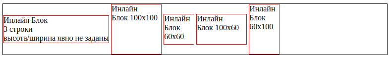

## HTML. Потоковые контейнеры

### Оглавление

[один](#)

### Свойство `display`


#### Значение `block`

```html
<div style="border:1px solid black">
  <div style="display:block; border:1px solid blue; width: 50%">Первый</div>
  <div style="display:block; border:1px solid red">Второй</div>
  <div style="display:none">Я - скрыт!</div>
  <div style="visibility:hidden">Я - невидим!</div>
</div>
```

<div style="border:1px solid black">
  <div  style="display:block; border:1px solid blue; width: 50%">Первый</div>
  <div style="display:block; border:1px solid red">Второй</div>
  <div style="display:none">Я - скрыт!</div>
  <div style="visibility:hidden">Я - невидим!</div>
</div>

Блоки прилегают друг к другу вплотную, если у них нет `margin`.

#### Значение `inline`

> ❗Ширина и высота элемента определяются по содержимому. Поменять их нельзя.

```html
<span style="border:1px solid black">
  <span style="border:1px solid blue; width:50%">Ширина</span>
  <a style="border:1px solid red">Игнорируется</a>
</span>
```

<span style="border:1px solid black">
  <span style="border:1px solid blue; width:50%">Ширина</span>
  <a style="border:1px solid red">Игнорируется</a>
</span>

Если вы присмотритесь внимательно к примеру выше, то увидите, что между внутренними `<span>` и `<a>` есть пробел. Это потому, что он есть в HTML. Если расположить элементы вплотную – его не будет.

Содержимое инлайн-элемента может переноситься на другую строку.
При этом каждая строка в смысле отображения является отдельным прямоугольником («line box»). Так что инлайн-элемент состоит из объединения прямоугольников.

```html
<div style="width:200px">
  ...<span style="background: lightgreen">
    Ля Ля Ля Ля Ля Ля Ля Ля Ля Ля Ля Ля Ля Ля Ля Ля Ля Ля Ля Ля Ля Ля Ля Ля Ля
    Ля Ля Ля Ля Ля Ля Ля Ля Ля Ля Ля Ля Ля Ля Ля </span
  >...
</div>
```

<div style="width:200px">
...<span style="background: lightgreen">
  Ля Ля Ля Ля Ля Ля Ля Ля Ля Ля Ля Ля Ля Ля Ля Ля Ля Ля Ля Ля
  Ля Ля Ля Ля Ля Ля Ля Ля Ля Ля Ля Ля Ля Ля Ля Ля Ля Ля Ля Ля
</span>...
</div>

#### Значение `inline-block`

Это значение – означает элемент, который продолжает находиться в строке (`inline`), но при этом может иметь важные свойства блока.

Как и `инлайн`-элемент:  
Располагается в строке.  
Размер устанавливается по содержимому.

Во всём остальном – это `блок`:  
Элемент всегда прямоугольный.  
Работают свойства `width`/`height`.

Это значение `display` используют, чтобы отобразить в одну строку блочные элементы, в том числе разных размеров.

```html
<style>
  li {
    display: inline-block;
    list-style: none;
    border: 1px solid red;
  }
</style>

<ul style="border:1px solid black; padding:0">
  <li>Инлайн Блок<br />3 строки<br />высота/ширина явно не заданы</li>
  <li style="width:100px;height:100px">Инлайн<br />Блок 100x100</li>
  <li style="width:60px;height:60px">Инлайн<br />Блок 60x60</li>
  <li style="width:100px;height:60px">Инлайн<br />Блок 100x60</li>
  <li style="width:60px;height:100px">Инлайн<br />Блок 60x100</li>
</ul>
```


Свойство `vertical-align` позволяет выровнять такие элементы внутри внешнего блока (добавили в style декларацию `vertical-align: middle;`):




https://learn.javascript.ru/display

[⬆ вернуться к началу](#оглавление)

https://html5css.ru/css/css_display_visibility.php

https://www.w3schools.com/cssref/pr_class_display.php

https://www.w3schools.com/cssref/playdemo.php?filename=playcss_display&preval=block

https://www.w3schools.com/css/css3_flexbox.asp

https://doka.guide/html/flow/

display:flex
https://html5book.ru/css3-flexbox/#display
https://doka.guide/css/flexbox-guide/

https://html5book.ru/css3-columns/#column-number-width

пикча с рабочего стола
display list item
display grid
