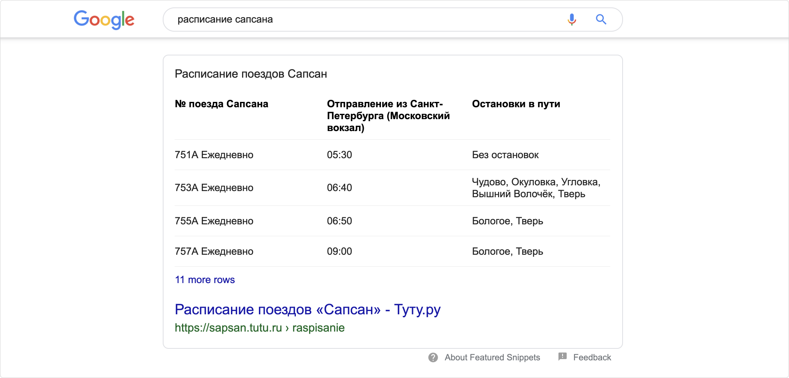

## HTML. Краткое руководство 📒

### Оглавление

[Cинтаксис HTML](#cинтаксис-html)  
[Структура HTML документа](#структура-html-документа)

<!-- TODO добавить оглавление-->

## Cинтаксис HTML

---

Синтаксис HTML – это правила написания HTML тэгов и HTML атрибутов.  
Для обозначения начала и конца элемента применяются **теги**. Внутри тегов могут быть _атрибуты_ со своими _значениями_ расширяющими возможности тега, и _основное содержимое_ тега:

```html

<тег атрибут="значение атрибута">Содержимое тега</закрывающий-тег>
```

Html-теги бывают **парными и одиночными**.  
Например, элемент <a\> — парный:

```html
<a href="путь">Нажми-меня</a>
```

Тег  — одиночный:

```html
" />
```

Одиночный тег не имеет второй половинки - **закрывающий тег**.

Парные теги могут содержать текст и **вложенные теги**.
Например, как в списках:

```html
<ul>
  <li>Элемент списка</li>
</ul>
```

> ❗ У вложенных тегов всегда нужно следить за правильным порядком закрытия. Вложенный тег не может закрываться позже
> родительского.

[⬆ вернуться к началу](#оглавление)

## Структура HTML-документа

---

Декларация **<\!DOCTYPE html>** определяет документ как HTML5  
Элемент **<html\>** является корневым HTML-страницы  
Элемент **<head\>** содержит мета-информацию  
Элемент **<title\>** (в head) задает заголовок документа  
Элемент **<body\>** содержит видимое содержимое страницы


Простейшая HTML-страница состоит как минимум из трёх элементов: **<html\>, <head\> и <body\>**. Основной (видимый) контент будет помещен в элемент <body\>.

Корневому элементу **<html\>** обычно добавляют важный атрибут lang (англ. «language»), пример:
`<html lang="ru">`

Тег **<head\>** хранит важную **служебную информацию**, пример `<title>Заголовок вкладки страницы</title>`.

В теге **<body\>** хранится основное содержимое страницы, которое отображается в окне браузера.

Пример [валидного](https://validator.w3.org/) html-документа, с подключенным файлом стиля и скрипта:

```html
<!DOCTYPE html>
<html lang="ru">
  <head>
    <meta charset="UTF-8" />
    <meta name="viewport" content="width=device-width, initial-scale=1.0" />
    <title>A valid HTML document</title>
    <meta name="description" content="My practice project" />
    <link rel="stylesheet" href="style.css" />
  </head>
  <body>
    <p>Основное содержимое страницы</p>

    <script src="script.js"></script>
  </body>
</html>
```

<!-- FIXME Нужно ли скрипт ставить в конец -->

> 🛠 Чем меньше веб-сайт, тем быстрее он грузится. Удивительно то, что страница на 14 КБ может грузиться гораздо быстрее, чем страница на 15 КБ, даже на 612 мс быстрее, хотя разница между страницами на 15 КБ и 16 КБ минимальна.
> [Почему ваш веб-сайт должен быть меньше 14 КБ](https://habr.com/ru/post/684836/)

[⬆ вернуться к началу](#оглавление)

<!-- TODO полная проверка -->
<!-- TODO якоря исправить-->

<!-- TODO свериться с mdn -->
<!-- FIXME проверить код -->
<!-- FIXME КУДА NAVBAR -->
<!-- FIXME КУДА NAV, зачем нужен -->
<!-- FIXME ПРОДОЛЖИТЬ С ASIDE-->

## Семантическая верстка

---

**Семантическая верстка** необходима для того, чтобы делать структуру документа более понятной на всех этапах использования, от разработки до публикации в интернете и индексации поисковыми машинами.  
Семантика прописана в стандартах. [(w3 специф.)](https://html.spec.whatwg.org/multipage/)

Поисковики не разглашают правила ранжирования, но известно, что наличие семантической разметки страниц помогает поисковым ботам лучше понимать, что находится на странице, и в зависимости от этого ранжировать сайты в поисковой выдаче.  
Классический пример — расписание поезда «Сапсан» в выдаче Google.


Структурные элементы **внутри `<body\>`** (пример):

```html
<body>
  <header class="main-header">
    <h1>Заголовок сайта</h1>
  </header>

  <main>
    <nav>Навигация</nav>

    <section>
      <h2>Свежие статьи</h2>
      <article>
        <h2>Заголовок статьи-1</h2>
        <p>Текст статьи</p>
      </article>
      <article>
        <h2>Заголовок статьи-2</h2>
        <p>Текст статьи</p>
      </article>
    </section>
  </main>

  <footer class="main-footer">Подвал сайта</footer>
</body>
```

> Книга - раздел - глава - абзац  
> main - section - article - p

#### <main\> — основное содержание

Сейчас мы проектируем структуру страниц на уровне крупных блоков. И первый такой тег — это тег <main\>.  
Тег **<main\>** выделяет **основное содержание страницы, которое не повторяется на других страницах** . На странице может быть только один <main\>

Наш сайт будет состоять из нескольких страниц. На каждой из них будут повторяющиеся шапка и подвал, а также уникальный контент страницы. Уникальный контент заключим в тег <main\>.

Например, на главной странице, которую мы сейчас верстаем, есть приветственный текст. Он является её основным контентом и на других страницах его не будет. А значит весь этот текст нужно заключить в тег <main\>. На внутренних страницах в <main\> будет уже другое **основное содержимое**.

> 💡 Спецификация не допускает использование на одной странице более одного тега <main\>, если у них нет специального атрибута hidden. Этот атрибут добавляется HTML-элементу, например, в одностраничных приложениях (Single Page Application), чтобы менять содержимое страницы, делая видимым тот или иной <main\> в разных состояниях приложения.

#### <header\> и <footer\>, (шапка и подвал)

Кроме уникального основного содержимого страницы, у нас есть повторяющиеся на других страницах **вводная часть** и **заключительная часть**.

Вводную часть страницы, которую чаще называют «шапкой», описывает тег <header\>. Аналогично ему, заключительную часть страницы, или «подвал», описывает тег <footer\> (англ. нижний колонтитул, подвал).

> 💡 Тег <header\> — это не только шапка сайта с логотипом и меню, он может использоваться, например, и как «шапка» какой-нибудь статьи или раздела сайта. Конечно, в случае со статьёй <header\> называют не «шапкой», а _вводной частью_, в которой могут содержаться заголовки, оглавление и так далее.
>
> 💡C тегом <footer\> ситуация аналогичная. В привычном понимании это подвал сайта, с копирайтами, контактной информацией и так далее. Но <footer\> может использоваться и в других разделах сайта. Например, внутри статьи в «подвале» можно разместить дополнительную информацию: данные об авторе, дополнительные ссылки и так далее. <footer\> можно считать _заключительной частью_

#### Тег section (логический раздел)

Было бы хорошо добавить на главную страницу что-то помимо приветствия, не правда ли? Давайте вставим в прототип ещё один раздел — про ваши навыки, пока с текстом-заглушкой. Теперь в основном содержании, то есть в теге <main\>, появились два смысловых раздела: «Приветствие» и «Навыки». Их нужно как-то друг от друга отделить.

В этом нам поможет специальный тег <section\>, который обозначает **крупный смысловой (или «логический») раздел**. Как понять, что раздел смысловой? Если вы можете дать ему имя, описывающее его содержание или назначение, то это точно он. Например:

```html
<section\>
  Раздел «О компании» Хм, наверное в нём будет описание компании
</section>
<section>
  Раздел «Редактирование профиля» Ага, здесь я управляю личными данными
</section>
```

Хороший пример использования <section\> — разделение книги на главы, ведь название главы описывает её содержание. Также одна глава, без остальных, воспринимается вырванной из контекста. То же самое с контентом главной страницы. Смысловые разделы составляют содержание страницы, но сами по себе, в отрыве от страницы, эти «секции» жить не могут и теряют смысл.

> 💡 Небольшая подсказка как отличать смысловые или логические разделы от структурных разделов. Логический раздел вы можете осмысленно назвать одним словом или словосочетанием: «программа обучения», «каталог», «наши преимущества». Если же в голову приходят названия, которые указывают на его положение на странице («шапка», «подвал», «левая колонка»), либо перечисления («новости и галерея», «фильтры и товары»), в таком случае раздел структурный и тег <section\> для него не подходит.

#### Тег article, (независимый раздел)

Теперь нам нужно сделать пост в блоге, для этого нам нужен подходящий тег.
И это тег <article\>, который обозначает **цельный, законченный и самостоятельный фрагмент информации.** А пост в блоге именно такой.

Тег <article\>, в отличие от <section\>, **можно вырвать из одного места и вставить в другое** (на другую страницу сайта или на другой сайт), и смысл содержимого тега при этом не потеряется. Примеры: статья, пост в блоге, сообщение на форуме и так далее.

```html
<article>Я фотка в Инстаграме, смотрюсь отлично где угодно</article>
```

> 💡 Теги <section\> можно использовать внутри <article\>, если там нужно выделить отдельные смысловые блоки.
>
> Точно так же можно использовать <article\> внутри <section\>, если в логическом разделе документа содержатся независимые контентные блоки.

#### Тег nav, (основная навигация)

Помните о задании инструктора Кекса? Мы разрабатываем сайт, на котором будет главная страница и записи блога. Поэтому нам нужно предусмотреть на главной странице навигационный блок, с которого можно будет перейти на определённые записи.

Для создания _логического раздела_ с основной навигацией предназначен тег <nav\> (сокращение от английского «navigation»). **Обычно в <nav\> включают ссылки на другие страницы или навигацию по текущей странице**. Пример:

```html
<nav>Первый пост, второй пост, архив постов</nav>
```

Со ссылками мы разберёмся в следующих частях. А пока что добавим навигационный раздел на главной странице. Этот раздел на главной будет особенным и на других страницах повторяться не будет, поэтому расположим его в основном содержании.

> 💡 Не каждая **группа ссылок** на странице должна быть обёрнута в <nav\>. Например, небольшой блок со вспомогательными ссылками в подвале сайта. Такой блок внутри тега <footer\> не нужно дополнительно оборачивать в тег <nav\>.
> Кроме того, блок <nav\> помимо ссылок может включать абзацы с текстом, заголовки, списки и другое содержание.

#### Тег aside, (дополнительное содержание)

Помимо <section\> и <article\> есть ещё один крупный логический контейнер. Это тег <aside\>.

Тег <aside\> включает в себя **дополнительное содержание, не связанное напрямую с основным.** Такие блоки ещё часто называют **«сайдбарами» или боковыми панелями**.

```html
<aside>Я скромный блок с курсами валют на сайте про рыбок</aside>
```

На нашей внутренней странице тоже стоит предусмотреть <aside\>. Позже мы сможем включить туда ссылки на похожие посты блога или ленту постов из Твиттера, или что-то подобное (кто знает, что придёт в голову боссу).

> 💡В стилях для прототипирования мы по-разному оформили теги, которые применяются для решения разных задач. При этом мы опирались на [систему типов](https://html.spec.whatwg.org/multipage/dom.html#kinds-of-content) спецификации HTML. _(Темплейт файла лежит в /content/outlines.css)_ Вот расшифровка:
>
> - Пунктиром выделен особый тег `<body\>`.
> - Синей рамкой выделяются [поточные теги](https://html.spec.whatwg.org/multipage/dom.html#flow-content) (_flow content_), которыми обычно размечают крупные структурные блоки страниц, например `<main\>`.
> - Фиолетовой рамкой выделяются [теги для создания смысловых разделов](https://html.spec.whatwg.org/multipage/dom.html#sectioning-content) (_sectioning content_), например `<section\>`.
> - Оранжевой рамкой выделяются [заголовочные теги](https://html.spec.whatwg.org/multipage/dom.html#heading-content), например `<h1\>`.
> - Розовой рамкой выделяются _поточные теги_, которыми обычно размечают непосредственно текстовые элементы, например `<p\>`.
>
> Конечно, в спецификации больше типов, но мы не стали оформлять все, а ограничились только теми тегами, которые понадобятся нам в прототипе.

#### ДРУГОЙ ИСТОЧНИК

❗ Не путайте **<section\>,<article\>,<div\>** между собой❗


**<section\>**

- Значение: (англ."раздел") смысловой или логический раздел документа. Неотделяемый, в отличие от <article\>.
- Особенности: желателен заголовок внутри, допускается вкладывать один элемент <section\> внутрь другого.
- **Использование:**
  блок "о компании", список товаров, раздел личной информации в профиле,
  блок новостей, контактной информации, глав текста, вкладок в диалоговом окне и так далее.

**<article\>**

- Значение: (англ."cтатья") самостоятельный, цельный и независимый раздел документа. Этот раздел можно в неизменном виде использовать в различных местах, в том числе и на других сайтах.
- Особенности: **Обязателен** заголовок внутри <h1\>,…,<h6\>.
- **Использование:**
  заголовок, текст, имя автора, дата публикации, метки, рейтинг статьи и др. <article\> обычно применяется для статей сайта, сообщений блога и форума, комментариев.

**<div\>** использовался как базовый элемент разметки в HTML4, допускается для создания потоковых контейнеров.

> 💡 Правило для определения **<article\>, <section\> и <div\>:**
>
> 1.  Можете дать имя разделу и вынести этот раздел на другой сайт? — <article\>
> 2.  Можете дать имя разделу, но вынести на другой сайт не можете? — <section\>
> 3.  Не можете дать имя? Получается что-то наподобие «новости и фотогалерея» или «правая колонка»? — <div\>
>
> - Для мелких фразовых элементов (слово или фраза) — <span\>.

**<aside\>**

- Значение: побочный, косвенный для страницы контент.
- Особенности: может иметь свой заголовок. Может встречаться несколько раз на странице.
- Типовые ошибки: считать <aside\> тегом для «боковой панели» и размечать этим тегом основной контент, который связан с окружающими его элементами.

**<nav\>**

- Значение: навигационный раздел со ссылками на другие страницы или другие части страниц.
- Особенности: используется для основной навигации, а не для всех групп ссылок. Основной является навигация или нет — на усмотрение верстальщика. Например, меню в подвале сайта можно не оборачивать в <nav\>. В подвале обычно появляется краткий список ссылок (например, ссылка на главную, копирайт и условия) — это не является основной навигацией, семантически для такой информации предназначен <footer\> сам по себе.
- Типовые ошибки: многие считают, что в <nav\> может быть только список навигационных ссылок, но согласно спецификации там может быть навигация в любой форме.

#### ПОВТОР <!-- TODO нужно ли продолжение ниже? -->

**<header\>**

- Значение: вводная часть смыслового раздела или всего сайта, обычно содержит подсказки и навигацию. Чаще всего повторяется на всех страницах сайта.
- Особенности: этих элементов может быть несколько на странице.
- Типовые ошибки: использовать только как шапку сайта.

**<main\>**

- Значение: основное, не повторяющееся на других страницах, содержание страницы.
- Особенности: должен быть один на странице, исходя из определения.
- Типовые ошибки: включать в этот тег то, что повторяется на других страницах (навигацию, копирайты и так далее).

**<footer\>**

- Значение: заключительная часть смыслового раздела или всего сайта, обычно содержит информацию об авторах, список литературы, копирайт и так далее. Чаще всего повторяется на всех страницах сайта.
- Особенности: этих элементов может быть несколько на странице. Тег <footer\> не обязан находиться в конце раздела.
- Типовые ошибки: использовать только как подвал сайта.
