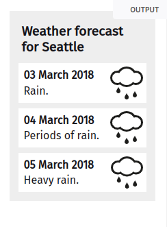
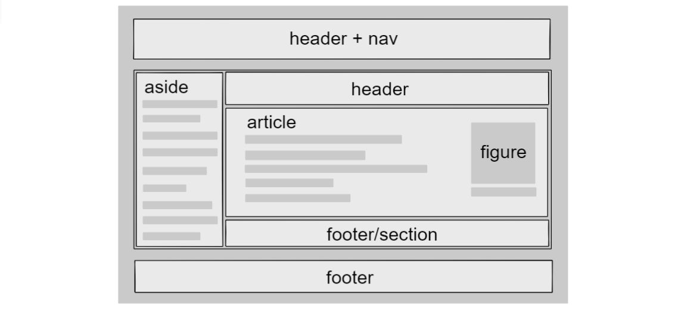

## HTML. Основы

### Оглавление

[Cинтаксис HTML](#cинтаксис-html)  
[Структура HTML документа](#структура-html-документа)  
[Семантическая верстка](#семантическая-верстка)

<!-- TODO добавить оглавление-->

## Cинтаксис HTML

---

Для обозначения начала и конца элемента применяются **теги**. Внутри тегов могут быть **атрибуты** со своими **значениями** расширяющими возможности тега, и **основное содержимое** тега:

```html

<тег атрибут="значение атрибута">Содержимое тега</закрывающий-тег>
```

Html-теги бывают **парными и одиночными**.  
Например, элемент `<a>` — парный:

```html
<a href="путь">Нажми-меня</a>
```

Тег `` — одиночный:

```html
" />
```

Одиночный тег не имеет второй половинки - **закрывающий тег**.

Парные теги могут содержать текст и **вложенные теги**.
Например, как в списках:

```html
<ul>
  <li>Элемент списка</li>
</ul>
```

> ❗ У вложенных тегов всегда нужно следить за правильным порядком закрытия. Вложенный тег не может закрываться позже
> родительского.

[⬆ вернуться к началу](#оглавление)

## Структура HTML-документа

---

- Декларация `<!DOCTYPE html>` определяет документ как HTML5
- Элемент `<html>` является корневым элементом страницы
- Элемент `<head>` содержит мета-информацию
  - Элемент `<title>` (в `<head>`) задает заголовок документа
- Элемент `<body>` содержит основное содержимое страницы


Простейшая HTML-страница состоит **как минимум** из трёх элементов: `<html>`, `<head>` и `<body>`.

Корневому элементу `<html>` обычно добавляют важный атрибут lang (англ. «language»), пример:
`<html lang="ru">`

Тег `<head>` хранит важную **служебную информацию**, пример: `<title>Заголовок вкладки страницы</title>`.

В теге `<body>`хранится **основное содержимое** страницы, которое отображается в окне браузера.

Пример [валидного](https://validator.w3.org/) html-документа, с подключенным файлом стиля и скрипта:

```html
<!DOCTYPE html>
<html lang="ru">
  <head>
    <meta charset="UTF-8" />
    <meta name="viewport" content="width=device-width, initial-scale=1.0" />
    <title>A valid HTML document</title>
    <meta name="description" content="My practice project" />
    <link rel="stylesheet" href="style.css" />
  </head>
  <body>
    <p>Основное содержимое страницы</p>

    <script src="script.js"></script>
  </body>
</html>
```

<!-- FIXME Нужно ли скрипт ставить в конец -->

> 🛠 Чем меньше веб-сайт, тем быстрее он грузится. Удивительно то, что страница на 14 КБ может грузиться гораздо быстрее, чем страница на 15 КБ, даже на 612 мс быстрее, хотя разница между страницами на 15 КБ и 16 КБ минимальна.
> [Почему ваш веб-сайт должен быть меньше 14 КБ](https://habr.com/ru/post/684836/)

[⬆ вернуться к началу](#оглавление)

## Семантическая верстка

---

**Семантическая верстка** необходима для того, чтобы делать структуру документа более понятной на всех этапах использования, от разработки до публикации в интернете и индексации поисковыми машинами.  
Семантика прописана в стандартах. [(w3 специф.)](https://html.spec.whatwg.org/multipage/)

Поисковики не разглашают правила ранжирования, но известно, что наличие семантической разметки страниц помогает поисковым ботам лучше понимать, что находится на странице, и в зависимости от этого ранжировать сайты в поисковой выдаче.  
Классический пример — расписание поезда «Сапсан» в выдаче Google.


Структурные элементы **внутри `<body>`** (пример):

```html
<body>
  <header class="main-header">
    <h1>Заголовок сайта</h1>
  </header>

  <main>
    <nav>Навигация</nav>

    <section>
      <h2>Свежие статьи</h2>
      <article>
        <h2>Заголовок статьи-1</h2>
        <p>Текст статьи</p>
      </article>
      <article>
        <h2>Заголовок статьи-2</h2>
        <p>Текст статьи</p>
      </article>
    </section>
  </main>

  <footer class="main-footer">Подвал сайта</footer>
</body>
```

> Книга - раздел - глава - абзац  
> main - section - article - p

#### `<main>` (основное содержание)

Сейчас мы проектируем структуру страниц на уровне крупных блоков. И первый такой тег — это тег `<main>`.  
Тег `<main>` определяет **основное содержание страницы, которое не повторяется на других страницах**. На странице может быть только один `<main>`

Например, на главной странице, которую мы сейчас верстаем, есть приветственный текст. Он является её основным контентом и на других страницах его не будет. А значит весь этот текст нужно заключить в тег `<main>`. На внутренних страницах в `<main>` будет уже другое **основное содержимое**.

> 💡 Спецификация не допускает использование на одной странице более одного тега `<main>`, если у них нет специального атрибута hidden. Этот атрибут добавляется HTML-элементу, например, в одностраничных приложениях (Single Page Application), чтобы менять содержимое страницы, делая видимым тот или иной `<main>` в разных состояниях приложения.

#### `<header>` и `<footer>` (шапка и подвал)

Кроме уникального основного содержимого страницы, у нас есть повторяющиеся на других страницах _вводная часть_ и _заключительная часть_.

Вводную часть страницы, которую чаще называют «**шапкой**», описывает тег `<header>`. Аналогично ему, заключительную часть страницы, или «**подвал**», описывает тег `<footer>`.

> 💡 Тег `<header>` — это не только шапка сайта с логотипом и меню, он может использоваться, например, и как «шапка» какой-нибудь **статьи** или **раздела сайта**. Конечно, в случае со статьёй `<header>` называют не «шапкой», а **вводной частью**, в которой могут содержаться заголовки, оглавление и так далее.  
> 💡 C тегом `<footer>` ситуация аналогичная. В привычном понимании это подвал сайта, с копирайтами, контактной информацией и так далее. Но `<footer>` может использоваться и в других разделах сайта. Например, внутри статьи в «подвале» можно разместить дополнительную информацию: данные об авторе, дополнительные ссылки и так далее. `<footer>` можно считать **заключительной частью**.

#### `<section>` (логический раздел)

Тег `<section>`, обозначает крупный смысловой (или «**логический**») раздел. Как понять, что раздел смысловой? Если вы можете дать ему имя, описывающее его содержание или назначение, то это точно он. Например:

```html
<section>
  Раздел «О компании» - Ну наверное в нём будет описание компании.
</section>
<section>
  Раздел «Редактирование профиля» - здесь я управляю личными данными.
</section>
```

**`<section>` обычно идёт как обёртка чего-то, по крайней мере так делает большинство.**

Хороший пример использования `<section>` — разделение книги на главы, ведь название главы описывает её содержание. Также одна глава, без остальных, воспринимается вырванной из контекста. То же самое с контентом главной страницы. Смысловые разделы составляют содержание страницы, но сами по себе, в отрыве от страницы, эти «секции» жить не могут и теряют смысл.

> 💡 Небольшая подсказка как отличать смысловые или логические разделы от **структурных** разделов (страничных).  
> **Логический раздел** вы можете осмысленно назвать одним словом или словосочетанием: «программа обучения», «каталог», «наши преимущества». Если же в голову приходят названия, которые указывают на его положение на странице («шапка», «подвал», «левая колонка»), либо перечисления («новости и галерея», «фильтры и товары»), в таком случае этот раздел **структурный** и тег `<section>` для него не подходит.

#### `<article>` (независимый раздел)

Тег `<article>` (англ. — статья), представляет самостоятельную часть документа, страницы, приложения или сайта, предназначенную для независимого распространения или повторного использования. . `<article>` обычно применяется для статей сайта, сообщений блога и форума, комментариев.

Каждый элемент `<article>` обязательно должен содержать заголовок через `<h1>`,…,`<h6>`. Минимальная структура элементов (пример):

```html
<article>
  <h1>Заголовок</h1>
  <p>Текст статьи, картинка или дата публикации</p>
</article>
```

**ЕЩЕ ПРИМЕР**


```html
<article class="forecast">
  <h1>Weather forecast for Seattle</h1>
  <article class="day-forecast">
    <h2>03 March 2018</h2>
    <p>Rain.</p>
  </article>
  <article class="day-forecast">
    <h2>04 March 2018</h2>
    <p>Periods of rain.</p>
  </article>
  <article class="day-forecast">
    <h2>05 March 2018</h2>
    <p>Heavy rain.</p>
  </article>
</article>
```

<details>
<summary>style.css</summary>

```css
.forecast {
  margin: 0;
  padding: 0.3rem;
  background-color: #eee;
  font: 1rem 'Fira Sans', sans-serif;
}

.forecast > h1,
.day-forecast {
  margin: 0.5rem;
  padding: 0.3rem;
  font-size: 1.2rem;
}

.day-forecast {
  background: right/contain content-box border-box no-repeat
    url('/media/examples/rain.svg') white;
}

.day-forecast > h2,
.day-forecast > p {
  margin: 0.2rem;
  font-size: 1rem;
}
```

</details>

Тег `<article>`, в отличие от `<section>`, можно вырвать из одного места и вставить в другое (на другую страницу сайта или на другой сайт), и смысл содержимого тега при этом не потеряется. Примеры: статья, пост в блоге, сообщение на форуме и так далее.

```html
<article>Я фотка в Инстаграме, смотрюсь отлично где угодно</article>
```

```html
<article class="film_review">
  <header>
    <h2>Парк Юрского периода</h2>
  </header>
  <section class="main_review">
    <p>Динозавры были величественны!</p>
  </section>
  <section class="user_reviews">
    <article class="user_review">
      <p>Слишком страшно для меня.</p>
      <footer>
        <p>
          Опубликовано
          <time datetime="2015-05-16 19:00">16 мая</time>
          Лизой.
        </p>
      </footer>
    </article>
    <article class="user_review">
      <p>Я согласен, динозавры мои любимцы.</p>
      <footer>
        <p>
          Опубликовано
          <time datetime="2015-05-17 19:00">17 мая</time>
          Томом.
        </p>
      </footer>
    </article>
  </section>
  <footer>
    <p>
      Опубликовано
      <time datetime="2015-05-15 19:00">15 мая</time>
      Стаффом.
    </p>
  </footer>
</article>
```

> 💡 Теги `<section>` можно использовать внутри `<article>`, если там нужно выделить отдельные смысловые блоки.  
> Точно так же можно использовать `<article>` внутри `<section>`, если в логическом разделе документа содержатся независимые контентные блоки.

#### `<nav>` (навигация)

Для создания логического раздела с основной навигацией предназначен тег `<nav>` (англ. «navigation»). Обычно в `<nav>` включают **ссылки на другие страницы или навигацию по текущей странице**. Пример:

```html
<nav class="menu">
  <ul>
    <li><a href="#">Главная</a></li>
    <li><a href="#">О нас</a></li>
    <li><a href="#">Контакты</a></li>
  </ul>
</nav>
```

> 💡 Не каждая **группа ссылок** на странице должна быть обёрнута в `<nav>`. Например, небольшой блок со вспомогательными ссылками в подвале сайта `<footer>` не нужно дополнительно оборачивать в тег `<nav>`.
>
> Кроме того, блок `<nav>` помимо ссылок может включать абзацы с текстом, заголовки, списки и другое содержание.

> ❗ Панель навигации нежелательно использовать отдельно от `<header>`, поскольку она совместима с семантическим HTML. Но это спорная тема.

#### `<aside>` (дополнительное содержание)

Помимо `<section>` и `<article>` есть ещё один крупный логический контейнер. Это тег `<aside>`.

Элемент `<aside>` (от англ. aside — в стороне, отступление) представляет собой раздел страницы, который имеет косвенное отношение к содержимому страницы и может быть рассмотрен отдельно от этого содержимого.
Тег `<aside>` включает в себя **дополнительное содержание**, не связанное напрямую с основным. Такие разделы часто представлены в виде боковых панелей в печатной типографике.

```html
<article>
  <p>
    Мультфильм студии Уолта Диснея <em>Русалочка</em>
    был выпущен в 1989.
  </p>
  <aside>
    <p>Мультфильм заработал $87 миллионов во время первого выпуска.</p>
  </aside>
  <p>Подробнее об этом мультфильме...</p>
</article>
```

Также `<aside>` применяется в стороне от `<main>` — для боковых панелей, рекламных блоков, ссылок на архив, комментариев, меток и другой информации,

```html
<body>
  <main>
    <article>
      <header>
        <h1>Название статьи</h1>
        <!-- Данные поста: Автор, даталайн -->
      </header>
      <main>
        <!-- Содержание статьи -->
        <aside><!-- Вытянутая цитата --></aside>
      </main>
      <aside><!-- Секция комментариев --></aside>
      <footer><!-- Дата публикации: теги, категории, навигация --></footer>
    </article>
  </main>
  <aside>
    <!-- Боковая панель веб-сайта: реклама, индекс сообщений, формы входа -->
  </aside>
</body>
```

> 💡В стилях для прототипирования мы по-разному оформили теги, которые применяются для решения разных задач. При этом мы опирались на [систему типов](https://html.spec.whatwg.org/multipage/dom.html#kinds-of-content) спецификации HTML. _(файл лежит в /content/outlines.css)_ Вот расшифровка:
>
> - Пунктиром выделен особый тег `<body>`.
> - Синей рамкой выделяются [поточные теги](https://html.spec.whatwg.org/multipage/dom.html#flow-content) (_flow content_), которыми обычно размечают крупные структурные блоки страниц, например `<main>`.
> - Фиолетовой рамкой выделяются [теги для создания смысловых разделов](https://html.spec.whatwg.org/multipage/dom.html#sectioning-content) (_sectioning content_), например `<section>`.
> - Оранжевой рамкой выделяются [заголовочные теги](https://html.spec.whatwg.org/multipage/dom.html#heading-content), например `<h1>`.
> - Розовой рамкой выделяются _поточные теги_, которыми обычно размечают непосредственно текстовые элементы, например `<p>`.
>
> Конечно, в спецификации больше типов, но в файле ограничились только теми тегами, которые понадобятся нам в прототипе.

#### ВЫВОД

> ❗ Не путайте **`<section>`,`<article>`,`<div>`** между собой

> Правило для определения `<article>`, `<section>` и `<div>`:
>
> - Можете дать имя разделу и вынести этот раздел на другой сайт? — `<article>`
> - Можете дать имя разделу, но вынести на другой сайт не можете? — `<section>`
> - Не можете дать имя? Получается что-то наподобие «новости и фотогалерея» или «правая колонка»? — `<div>`


