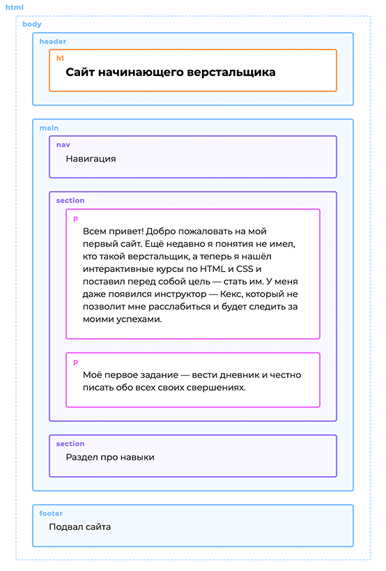

## HTML. Краткое руководство <a name="top"></a>

[Базовый синтаксис HTML](#syntax)  
[Структура HTML документа](#structure)

<a name="syntax"></a>

## Базовый синтаксис HTML

---

Для обозначения начала и конца элемента применяются теги. Внутри тегов могут быть атрибуты со своими значениями,
расширяющими возможности тега, а также основное содержимое тега.

```html

<тег атрибут="значение атрибута">Содержимое тега</закрывающий тег>

    <a href="link1.html">Нажми-меня</a>
```

Html-теги бывают **парными и одиночными**. Например, тег  — одиночный.

```html

```

Одиночный тег не имеет второй половинки - **закрывающий тег**.  
Парные теги могут содержать текст и другие (вложенные) теги.  
В закрывающих тегах перед именем ставится символ / («слэш»).

В парные теги можно вкладывать другие теги. Например, как в списках:

```html

<ul>
    <li>Элемент списка</li>
</ul>
```

❗ У вложенных тегов всегда нужно следить за правильным порядком закрытия. Вложенный тег не может закрываться позже
родительского.

<a name="structure"></a>

## Структура HTML-документа

---



Декларация <\!DOCTYPE html> определяет документ как HTML5  
Элемент <html\> является корневым элементом HTML-страницы  
Элемент <head\> содержит мета-информацию о документе  
Элемент <title\> задает заголовок документа  
Элемент <body\> содержит видимое содержимое страницы  
Элемент <p\> определяет абзац

Пример валидного html-документа:

```html
<!DOCTYPE html>
<html lang="ru">
<head>
    <meta charset="UTF-8"/>
    <meta name="viewport" content="width=device-width, initial-scale=1.0"/>
    <title>A valid HTML document</title>
    <meta name="description" content="My practice project"/>
    <link rel="stylesheet" href="style.css"/>
</head>
<body>
<p>Элементы со скриншота</p>
<script src="script.js"></script>
</body>
</html>
```

Cтруктурные блоки:

## Миксование Классов

---

У HTML-элемента может быть сколько угодно классов, в этом случае они перечисляются в атрибуте class **через пробел**,
например:

```html

<li class="product">Товар</li>
<li class="product hit">Товар, а ещё хит продаж</li>
<li class="product hit sale">Товар, хит продаж и со ски-и-идкой!</li>
```

Использование нескольких классов — это типовой приём, который ещё называется **миксованием классов**. Обычно его
используют так: в один класс выносят общее оформление, а в дополнительных классах описывают его модификации.
